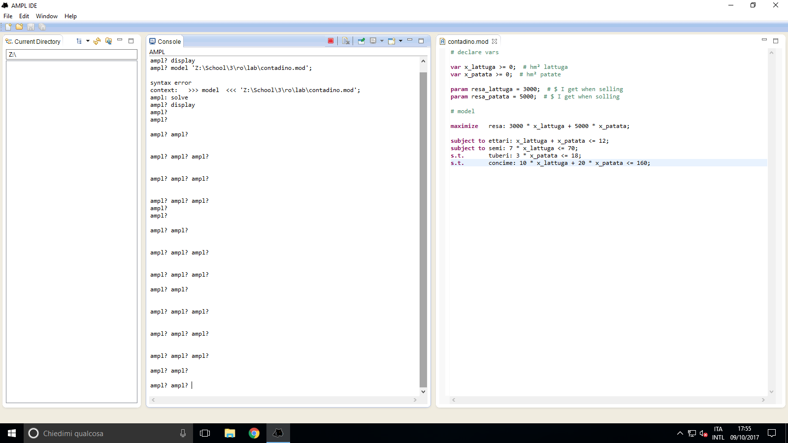

# Amplers

*A collection of linear programming models discussed in RO course, written in AMPL*


[](https://opensource.org/licenses/Apache-2.0) [](https://github.com/fiup/amplers/issues) [](https://www.apache.org/licenses/LICENSE-2.0)


## Usage
Be sure to [download](http://ampl.com/products/solvers/open-source/) one of the AMPL solvers and to add the correct path in the [right place](/models/contadino/model.mod#L31).


## Example
Once you [downloaded](#usage) all necessary software, simply
```shell
$ cd `folder where model is .. e.g models/contadino/`
$ ampl
ampl: model model.mod
ampl: solve;
CBC 2.9.9 optimal, objective 44000
2 iterations
ampl: display x_lattuga, x_patata, resa;
x_lattuga = 8
x_patata = 4
resa = 44000
```


## Available models
| name | category | solution |
| ------------- | ------------- | ------------- |
| [agricoltore agricolo](models/contadino) | `mix-ottimo di produzione` | `x_patata = 4, x_lattuga = 8, resa = 44000` |
| [telecomandi](models/telecomandi) | `mix-ottimo di produzione` | `x_A = 6, x_B = 2, total_gain = 34` |
| [produzione forza lavoro](models/prod-forza-lavoro) | `mix-ottimo di produzione` | `x_1 = 430, x_2 = 200, x_3 = 508, total_gain = 42300` |
| [produzione capacità eccedente](models/prod-cap-eccedente) | `mix-ottimo di produzione` | `factory_1 = 500, factory_2 = 600, factory_3 = 300, total_gain = 14900` |
| [dieta](models/dieta) | `copertura di costo minimo` | `x_verdura = 5, x_carne = 0, x_frutta = 0, cost = 20` |


## Help, something is wrong
- Remember to add a semicolon at the end of *mostly* all commands .. 


## Questions and issues
The [github issue tracker](https://github.com/fiup/amplers/issues) is **only** for bug reports and feature requests.


## Contributing
[Fork](https://github.com/fiup/amplers/fork) | Patch | Push | [Pull request](https://github.com/fiup/amplers/pulls)


## License
[Apache License](http://www.apache.org/licenses/LICENSE-2.0) Version 2.0, January 2004
